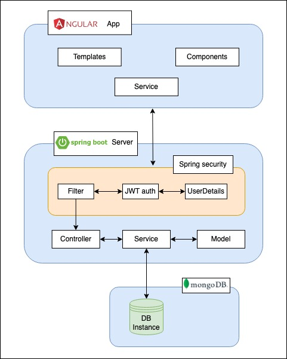
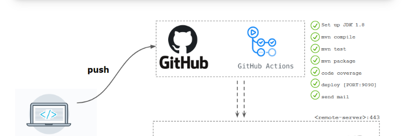
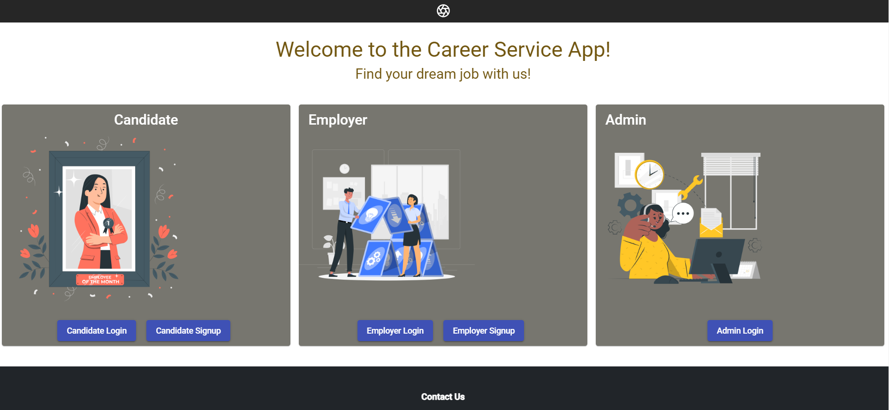
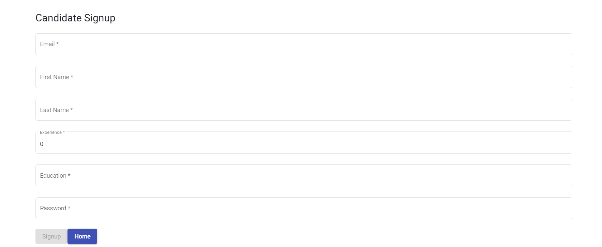
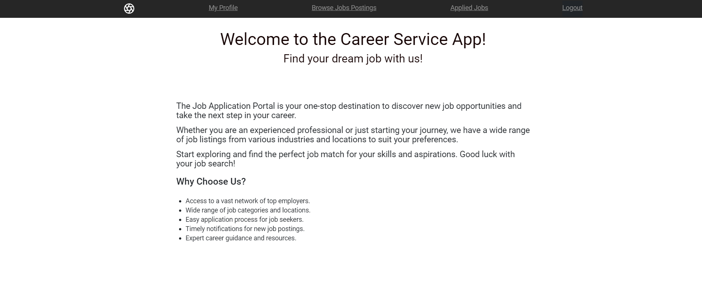
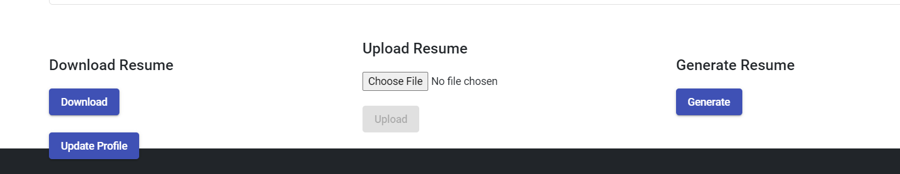
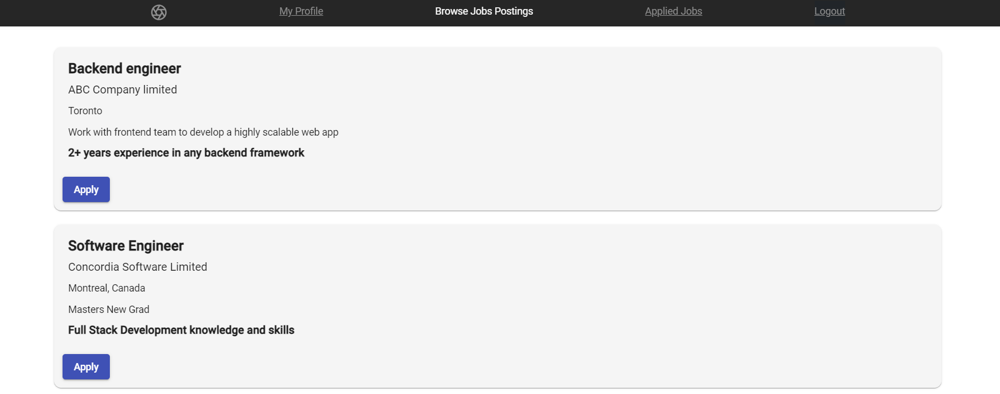
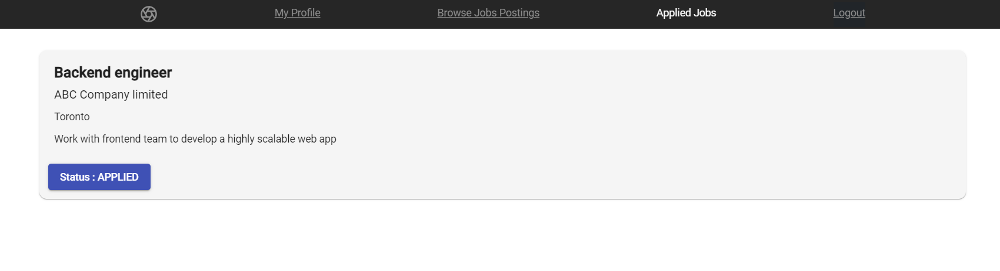
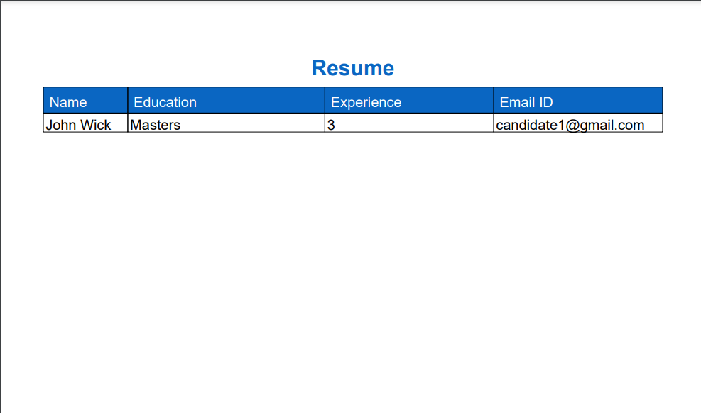

# Career Services Application

## 1. Description
This project aims to establish a platform for career services that allows students who are seeking employment to upload and regularly update their portfolios while enabling employers to post job opportunities. This platform focuses on facilitating job hunting conveniently. The system offers several features, such as assisting job seekers in finding potential employment options, and employers to search for specific candidates based on their requirements. Accessing the platform only requires a PC or mobile device with internet connectivity. To utilize the online career services system, both students and employers need to create an account and log in using their email and password. Students can create or modify their profiles and browse and apply for job postings, whereas employers can create and manage job listings and review candidate applications. The login credentials for this system are highly secure, ensuring that unauthorized access is prevented. The platform also offers a notification system that alerts employers when students apply for their job offers, and students will be notified when they are invited for an interview.

The primary users and the features they are offered are mentioned below:
1. Employer – create an account/register, login, browse candidates, add job offers, select candidates that have already applied to an offer for an interview, track the post
2. Student/Candidate – create an account/register, login, and build/upload a resume; browse and apply for job offers; track applications
3. Admin – Managing all user profiles, postings and tracking

## 2. Team Members
1. Manan Paruthi (MannParutthi) - 40192620
     Role - Implementation Manager and Frontend Developer
     Strengths - Angular, Spring Boot
2. Ashwin Raghunath (ashraghunath) - 40192120
     Role - Architect and Backend Developer
     Strengths - Spring Boot, Security and Cloud
3. Nipun Hedaoo (nipunh) - 40165942
     Role - Support Manager and Frontend Developer 
     Strengths - Angular, MongoDB
4. Jwalit Shah (jwalit21) - 40227541
     Role - Quality Analyst and Frontend Developer
     Strengths - Angular, Spring Boot
6. Dinesh Kini (dinesh-07) - 40231799
     Role - DevOps and Backend Developer
     Strengths - Spring Boot, JUnit, Github action CI/CD
8. Anagha Harinath (Anagha630) - 40224578
     Role - Scrum Master and Backend Developer
     Strengths - Spring Boot, MongoDB

## 3. Project Approach & Technology
* Frontend - Angular  
We chose Angular for its ability to simplify the development process while providing high-performing and dynamic
web applications. Its intuitive and straightforward design makes it a great choice for our project. This versatility
allows us to deliver an engaging and user-friendly experience.

* Backend - Springboot  
Spring Boot is a great fit due to its ability to expedite development within a short timeframe. It simplifies setup and configuration, allowing us to focus on building core features. Additionally, Spring Boot's security features provide a solid foundation for protecting user data.

* Authentication & Authorization - In Springboot - with Bearer JWT Token  
Authentication and Authorization using JWT. Once the user is logged in, each subsequent request will include the JWT, allowing the user to access routes, services, and resources that are permitted with that token. To achieve this, packages for JWT tokens are available in Spring boot and that can be used to achieve the goal.

* Database - MongoDB  
By using MongoDB, we will benefit from its flexible data model, which allows
us to store and manage data in a way that makes sense for our specific use case. MongoDB also provides ease
of use, with a simple and intuitive interface that makes it easy to interact with the data. Additionally, MongoDB's 
compatibility with Spring Boot, allows for seamless integration with our application, improving overall efficiency
and performance.

* Documentation - GitHub Wiki  
We will use Github Wiki since it is easily accessible and conveniently located within your project repository hence allowing for seamless navigation and quick access to project documentation. 

### System architecture

### Github Action CI/CD

### Career Services Application Website

## Candidate Sign up

## Candidate Home page

## Candidate Profile Update

## All Jobs

## Candidate Applied Jobs

### Candidate Generated Resume

